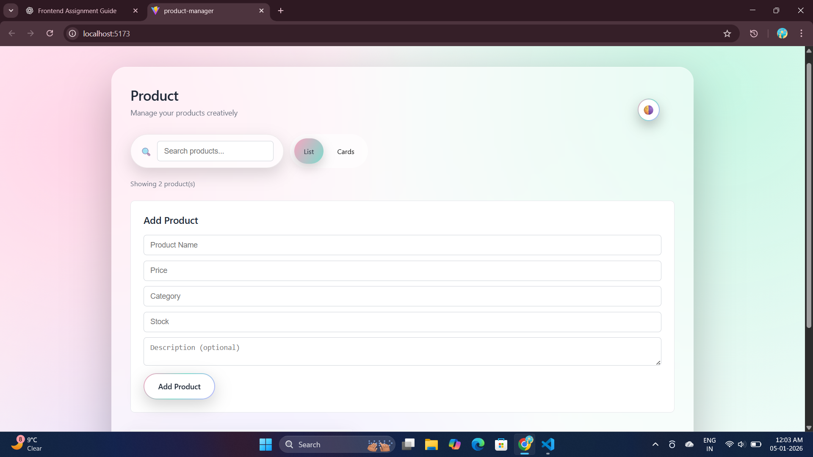
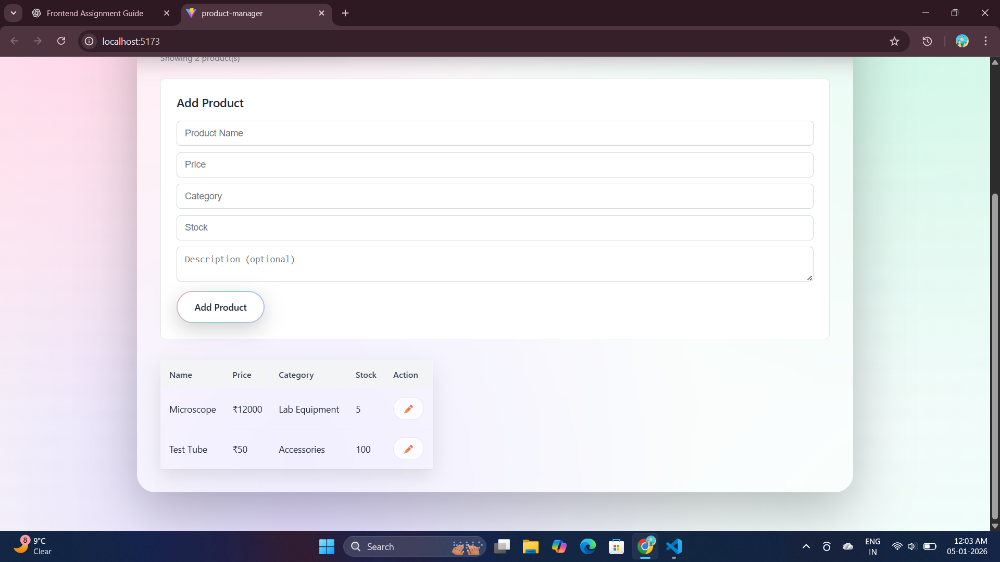
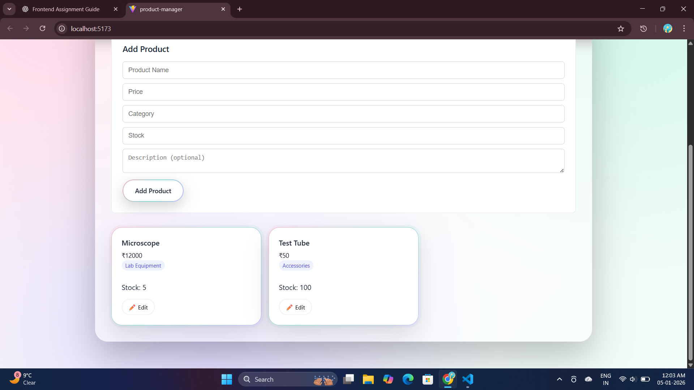
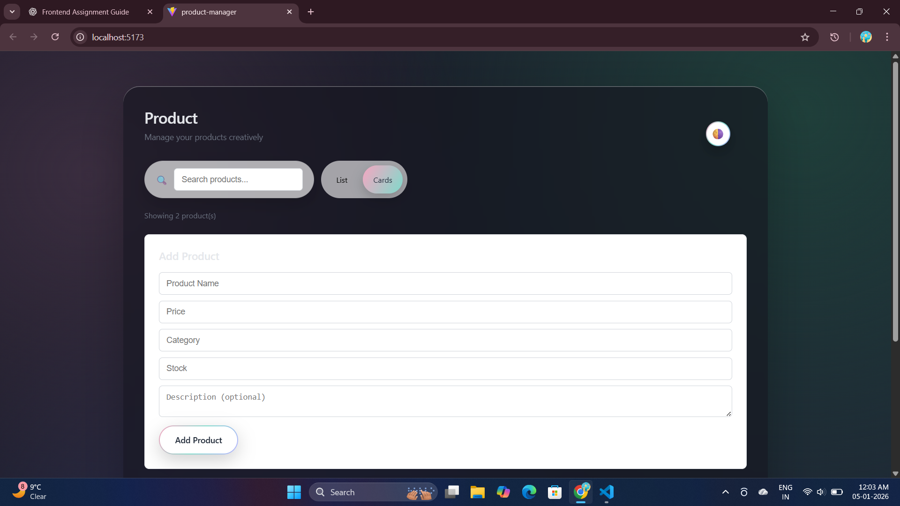
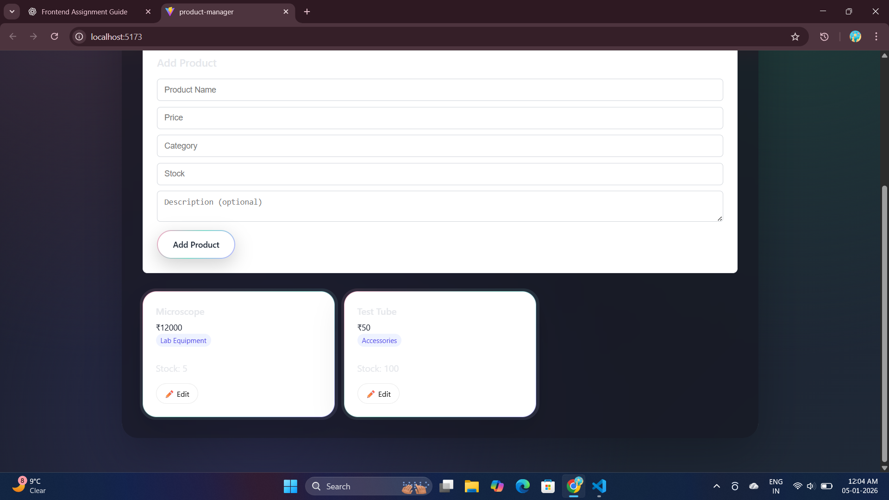

Product Manager – Frontend Assignment

A modern, responsive Product Management UI built as part of a frontend assignment.
The application allows users to manage products efficiently with an intuitive, designer-focused interface and smooth user experience.

✨ Features
📦 Product Management

Add new products

Edit existing products

All data is stored in memory only (no backend)

🔍 Search (with Debounce)

Real-time product search by name

500ms debounce for better performance and UX

🔄 Multiple Views

List View (table)

Card View (grid)

Smooth toggle between views

📄 Pagination

Pagination for product list

Automatically adapts to filtered results

🎨 UI & UX

Clean, modern, and responsive design

Artistic pastel gradient background

Designer search bar and controls

Light / Dark pastel theme toggle

Subtle animations and micro-interactions

🛠 Tech Stack

React (Vite)

JavaScript (ES6+)

CSS (custom, no UI framework)

No backend / No API integration

🚀 Getting Started
1. Clone the repository
git clone <your-repo-url>
cd product-manager

2. Install dependencies
npm install

3. Run the project
npm run dev

The app will be available at:

http://localhost:5173

📁 Project Structure
src/
│── components/
│   ├── ProductForm.jsx
│   ├── ProductList.jsx
│   ├── ProductCard.jsx
│   ├── Pagination.jsx
│   ├── ViewToggle.jsx
│
│── data/
│   └── initialProducts.js
│
│── App.jsx
│── main.jsx
│── index.css

🧠 Design & UX Decisions

In-memory state was used to match assignment requirements.

Debounced search improves performance and usability.

Minimal yet artistic UI to avoid over-design while staying visually appealing.

Consistent curves and spacing for a cohesive interface.

Theme toggle added for better user experience and accessibility.

📸 Screenshots

### Light Mode

### Card View

### Dark Mode

🌐 Deployment

The application is deployed using a modern hosting platform:

Netlify / Vercel

🔗 Live Demo:
<PASTE DEPLOYED LINK HERE>

✅ Assignment Requirements Covered

✔ Product list (table & card view)
✔ View toggle
✔ Real-time search with debounce
✔ Add & edit product form with validation
✔ Pagination
✔ Responsive, user-friendly UI
✔ No backend used

👩‍💻 Author

Yogita Jangid
Frontend Developer